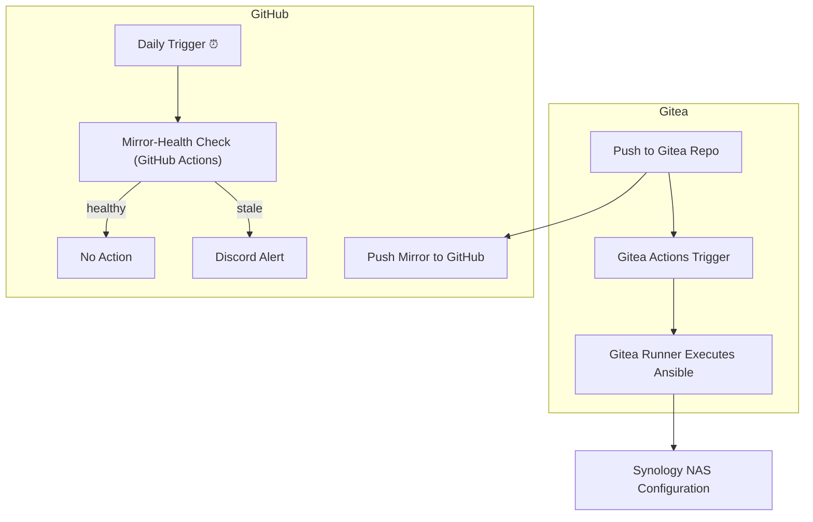
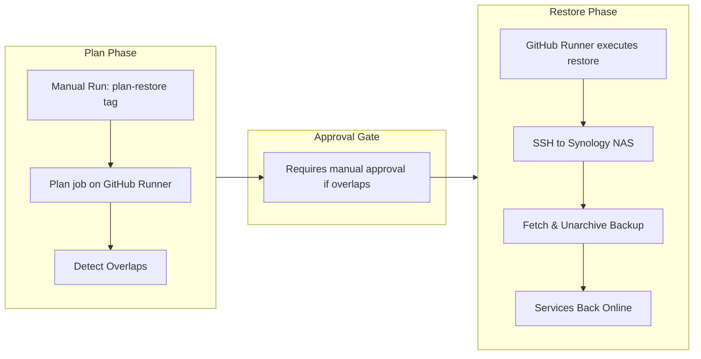

# Bootstrap IaC for the Jackson Family Self-Hosted Infrastructure

Welcome to **my** bootstrap repository for The Jackson Family’s self-hosted infrastructure.
I use this repo to bootstrap and maintain the core foundation for my home-network Infrastructure as Code (IaC)—installing Gitea on a Synology 
NAS, and restoring it's backup from an off-site backup on Backblaze. 

It is not monolithically responsible for _all_ (IaC) on my personal network. The Gitea recovery will restore additional
IaC CI/CD repos and workflows. This is meant to ensure I always have a reliable disaster-recovery path. 

The only prerequisites to performing a disaster recovery are:
1. There is an available self-hosted Github runner on the home network and...
2. that runner is attached to the mirror of this repo on Github.com and...
3. there is a Synology NAS available on the home network...
4. with the hostname defined in the Github repo's secret `SSH_NAS_HOST` and...
5. the "Container Manager" package (aka Docker) is compatible with this NAS...
6. and there is a latest backup of the Gitea data on Backblaze in the `B2_BUCKET`

---

## How I’ve Organized This Repo

```text
.gitea/
└── workflows/
    └── deploy.yml            # Daily deployments via Gitea Actions
.github/
├── workflows/
│   ├── common-bootstrap.yml # Core provisioning steps (reusable)
│   ├── bootstrap.yml        # GitHub-triggered DR bootstrap (manual phases)
│   └── mirror-health.yml    # Daily mirror-health check + Discord alerts
playbooks/                    # My Ansible playbooks & roles (NAS, Gitea, DNS, certs)
inventory.ini (or hosts.yml) # Ansible inventory for my network hosts
```

---

## My Methodology

1. **Daily Deployments**: Pushes to `.gitea/workflows/deploy.yml` trigger real applies via my Gitea runners (`dry_run=false, restore=false`).
2. **Mirror & Monitor**: All IaC is mirrored to GitHub. A daily job checks the mirror and notifies Discord if stale.
3. **DR Test**: Monthly scheduled run on GitHub uses `dry_run=true, restore=false` to validate playbooks in check mode.
4. **On-Demand Recovery**: The DR workflow is manual and two-phased—first a "plan" detect overlaps, then a gated "restore" with `--skip-tags plan-restore`.

---

## Architecture Diagrams

### Normal Operation (Happy Path)



### Failure & Recovery Mode



---

## Local Development

To test the Ansible playbooks and GitHub Actions workflows locally before committing, you can use `act`. This allows you to run the workflows in an environment that closely mimics the GitHub Actions runners.

First, you'll need to create two files in the root of the project to provide the necessary secrets and variables to `act`.

**`.secrets`** (for sensitive values):
```
NAS_SSH_PASSWORD=<your_ssh_password>
SSH_KEY=<your_private_ssh_key>
B2_ACCESS_KEY=<your_b2_access_key>
B2_SECRET_KEY=<your_b2_secret_key>
DISCORD_WEBHOOK_URL=<your_discord_webhook>
GITEA_DB_PASSWORD=<your_gitea_db_password>
DNSIMPLE_OAUTH_TOKEN=<your_dnsimple_oauth_token>
```

**`.vars`** (for non-secret configuration):
```
NAS_HOST=<your_nas_host>
NAS_SSH_USER=<your_ssh_user>
CERTBOT_EMAIL=<your_certbot_email>
```

**Important:** These files should not be committed to the repository. The `.gitignore` file is already configured to ignore them.

Once you've created these files, you can run the `bootstrap.yml` workflow locally using the `Makefile`:

```bash
make act-test
```

This command will execute the workflow in a Docker container that mirrors the `ubuntu-latest` environment used by GitHub Actions.

---

## What You Need to Do Once

### 1. DSM Certificate Import

* In DSM: **Control Panel → Security → Certificate → Add → Import**
* Import your `nas.lan.jaxzin.com` cert and name it `nas-lan`.
* Note `/usr/syno/etc/certificate/nas-lan` folder.

### 2. Gitea CI Variables

In Gitea (Settings → Actions → Variables):

| Name                  | Value/Purpose                         |
| --------------------- | ------------------------------------- |
| `SSH_KEY`             | SSH private key for `admin` on NAS    |
| `NAS_SSH_USER`        | NAS SSH user (`admin`)                |
| `NAS_HOST`            | FQDN/IP of NAS (`nas.lan.jaxzin.com`) |
| `B2_ACCESS_KEY`       | Backblaze B2 key ID                   |
| `B2_SECRET_KEY`       | Backblaze B2 Secret Key               |
| `DISCORD_WEBHOOK_URL` | Discord webhook for mirror-health     |

Ensure at least one Gitea runner (Docker) is registered and online.

### 3. Gitea Admin User

The initial Gitea administrator user is created automatically by the Ansible playbook. The credentials for this user are sourced from environment variables within your CI/CD system (e.g., Gitea Actions secrets).

You must define the following variables/secrets for the admin user creation to succeed:

| Name | Value/Purpose |
| --- | --- |
| `GITEA_ADMIN_USERNAME` | The desired username for the Gitea administrator. |
| `GITEA_ADMIN_PASSWORD` | The password for the Gitea administrator. |
| `GITEA_ADMIN_EMAIL` | The email address for the Gitea administrator. |

### 4. GitHub Secrets

In GitHub (Settings → Secrets → Actions):

| Secret                | Value/Purpose              |
| --------------------- | -------------------------- |
| `SSH_KEY`             | Same NAS SSH key           |
| `NAS_SSH_USER`        | Same NAS SSH user          |
| `NAS_SSH_HOST`        | FQDN/IP of NAS             |
| `B2_ACCESS_KEY`       | Backblaze B2 key ID        |
| `B2_SECRET_KEY`       | Backblaze B2 Secret Key    |
| `DISCORD_WEBHOOK_URL` | Discord webhook for alerts |

Register at least one self-hosted GitHub runner off the NAS, labeled `dr`.

---

## Workflow Details

### Daily Gitea Workflow (`.gitea/workflows/deploy.yml`)

* Runs on push.
* Calls `common-bootstrap.yml` with `dry_run=false, restore=false`.

### Common Bootstrap (`.github/workflows/common-bootstrap.yml`)

* Reusable steps: checkout, SSH setup, run Ansible.
* Inputs: `dry_run`, `restore`.

### DR Bootstrap (`.github/workflows/bootstrap.yml`)

* **Plan job** uses `--tags plan-restore` to detect overlaps and exits non-zero if found.
* **Approval job** gated on overlaps and requires manual approval (protected env).
* **Restore job** runs with `--skip-tags plan-restore --extra-vars "restore=true"`.

### Mirror-Health Check (`.github/workflows/mirror-health.yml`)

* Daily.
* Checks freshness of mirror and uses `Ilshidur/action-discord@v2` for alerts.

---

## Performing Recovery from GitHub

1. Provision replacement NAS and point DNS.
2. Ensure off-NAS runner `dr` can SSH in.
3. On GitHub, run **Plan** step via Actions → Bootstrap; review overlaps.
4. Approve if safe.
5. Restore automatically runs, unarchiving backup and restarting services.

---

## Ongoing Maintenance

* **Monthly DR tests** validate playbooks.
* **Daily mirror-health** alerts keep you aware.
* **The most critical IaC** lives on Gitea _and_ GitHub, so hardware failures don’t lose automation.

Happy automating The Jackson Family way! 🚀

---

## License

This project is licensed under the MIT License - see the [LICENSE](LICENSE) file for details.
