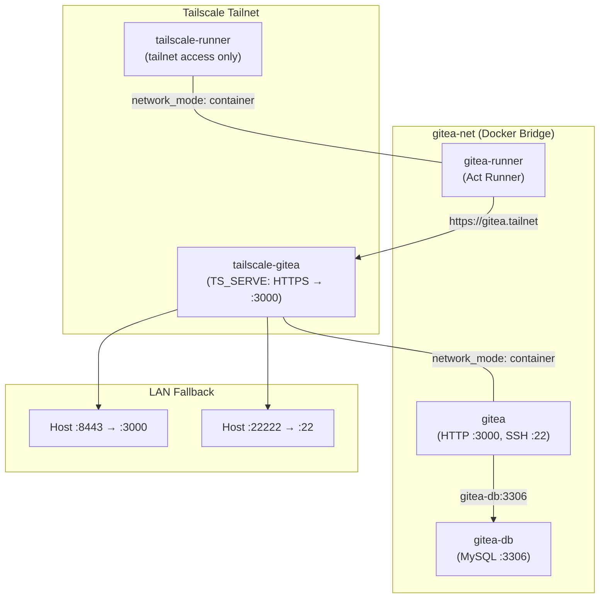
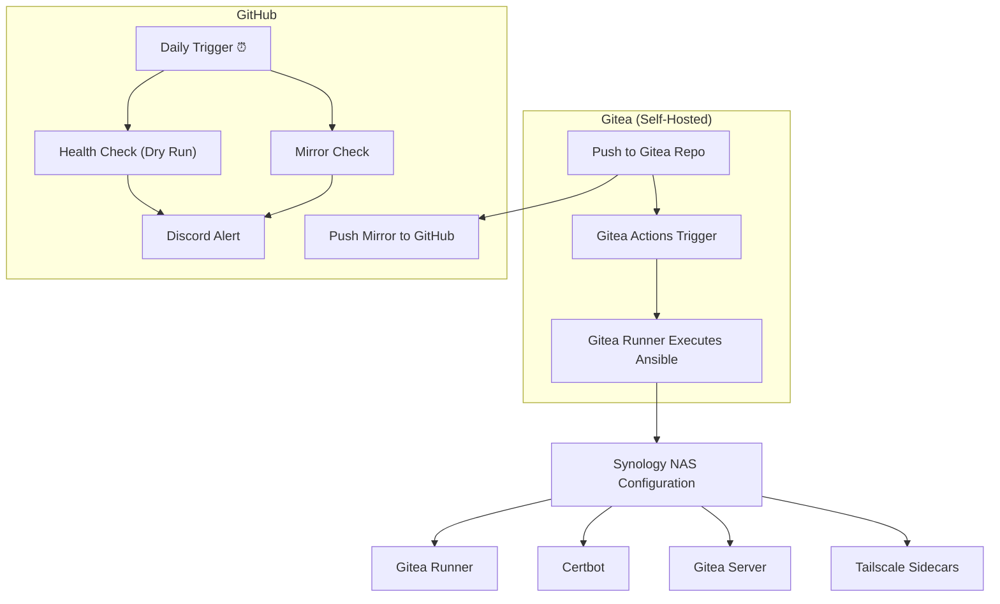
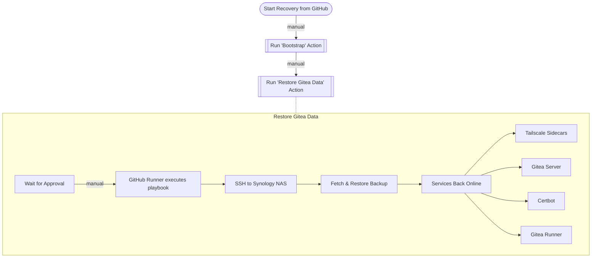

# Bootstrap IaC for the Jackson Family Self-Hosted Infrastructure

Welcome to **my** bootstrap repository for The Jackson Family’s self-hosted infrastructure.
I use this repo to bootstrap and maintain the core foundation for my home-network Infrastructure as Code (IaC)—installing Gitea on a Synology
NAS, and restoring it’s backup from an off-site backup on Backblaze.

It is not monolithically responsible for _all_ (IaC) on my personal network. The Gitea recovery will restore additional
IaC CI/CD repos and workflows. This is meant to ensure I always have a reliable disaster-recovery path.

The only prerequisites to performing a disaster recovery are:
1. There is an available self-hosted Github runner on the home network and...
2. that runner is attached to the mirror of this repo on Github.com and...
3. there is a Synology NAS available on the home network...
4. with the hostname defined in the Github repo’s variable `NAS_HOST` and...
5. the "Container Manager" package (aka Docker) is compatible with this NAS...
6. there is a latest backup of the Gitea data on Backblaze in the `B2_BUCKET_NAME`...
7. and the Tailscale auth key and tailnet domain are configured in the repo’s secrets/variables

---

## How I’ve Organized This Repo

```text
.gitea/
└── workflows/
    └── deploy.yml              # Daily deployments via Gitea Actions
.github/
├── workflows/
│   ├── bootstrap.yml           # GitHub-triggered DR bootstrap (recovery phase 1)
│   ├── common-bootstrap.yml    # Core provisioning steps (reusable)
│   ├── health-check.yml        # Daily dry run of DR bootstrap with Discord alert
│   ├── mirror-health.yml       # Daily mirror-health check with Discord alert
│   └── restore.yml             # GitHub-triggered DR restore (recovery phase 2, 🛑 DANGER)
playbooks/
├── roles/
│   ├── certbot/                # Let’s Encrypt certificate management
│   ├── gitea_backup/           # Gitea backup to Backblaze B2
│   ├── gitea_runner/           # Gitea Actions runner deployment
│   ├── gitea_server/           # Gitea server + MySQL deployment
│   └── tailscale_sidecar/      # Reusable Tailscale sidecar container
├── templates/
│   └── app.ini.j2              # Gitea configuration template
├── vars/
│   └── main.yml                # All playbook variables
├── gitea-deploy.yml            # Main deployment playbook
└── gitea-restore.yml           # Restore playbook
Makefile                        # Makefile for common tasks
```
---

## My Methodology

1. **Self-hosted Deployments**: Day-to-day modifications of my infrastructure are pushed to the self-hosted Gitea instance, including changes to the bootstrap infrastructure stored in this repository.
2. **Mirror & Monitor**: Every push to the self-hosted Gitea instance of this repo are immediately mirrored to the off-site GitHub mirror (where you are probably reading this). A daily job compares the self-hosted and cloud-hosted instance and notifies my personal Discord if they have drifted.
3. **DR Test**: Daily scheduled run on GitHub uses Ansible's check mode (with diffs) to validate playbooks. The results are posted to my personal Discord.
4. **On-Demand Recovery**: The DR workflow is manual and two-phased — first the bare infrastructure is bootstrapped, then a gated restore of the Gitea data from its latest cloud backup.

---

## Architecture Diagrams

### Container Networking (Tailscale Sidecar Pattern)


```mermaid
flowchart TB
    subgraph Tailnet["Tailscale Tailnet"]
        TG_TS["tailscale-gitea<br/>(TS_SERVE: HTTPS → :3000)"]
        TR_TS["tailscale-runner<br/>(tailnet access only)"]
    end
    subgraph DockerNet["gitea-net (Docker Bridge)"]
        TG_TS --- |"network_mode: container"| Gitea["gitea<br/>(HTTP :3000, SSH :22)"]
        DB["gitea-db<br/>(MySQL :3306)"]
        TR_TS --- |"network_mode: container"| Runner["gitea-runner<br/>(Act Runner)"]
    end
    subgraph LAN["LAN Fallback"]
        LAN_HTTP["Host :8443 → :3000"]
        LAN_SSH["Host :22222 → :22"]
    end
    TG_TS --> LAN_HTTP
    TG_TS --> LAN_SSH
    Gitea --> |"gitea-db:3306"| DB
    Runner --> |"https://gitea.tailnet"| TG_TS
```

### Normal Operation (Happy Path)


```mermaid
flowchart TB
    subgraph Gitea_CI["Gitea (Self-Hosted)"]
        A[Push to Gitea Repo] --> B[Gitea Actions Trigger]
        B --> C[Gitea Runner Executes Ansible]
    end
    subgraph GitHub_CI["GitHub"]
        A --> E[Push Mirror to GitHub]
        T["Daily Trigger ⏰"]
        T --> F["Mirror Check"]
        F --> G["Discord Alert"]
        T --> H["Health Check (Dry Run)"]
        H --> G
    end
    C --> D[Synology NAS Configuration]
    D --> D1[Tailscale Sidecars]
    D --> D2[Gitea Server]
    D --> D3[Certbot]
    D --> D4[Gitea Runner]
```

### Failure & Recovery Mode


```mermaid
flowchart TB
    Start([Start Recovery from GitHub])
    Start -->|manual| Action_B[[Run 'Bootstrap' Action]]
    Action_B -->|manual| Action_R[[Run 'Restore Gitea Data' Action]]
    subgraph Restore[Restore Gitea Data]
        direction LR
        Approval[Wait for Approval]
        Approval -->|manual| R[GitHub Runner executes playbook]
        R --> M[SSH to Synology NAS]
        M --> N[Fetch & Restore Backup]
        N --> P[Services Back Online]
        P --> P0[Tailscale Sidecars]
        P --> P1[Gitea Server]
        P --> P2[Certbot]
        P --> P3[Gitea Runner]
    end
    Action_R -.- Restore
```

---

## Contributing

Details on how to contribute to this project, including how to set up a local development environment,
can be found in the [CONTRIBUTING.md](CONTRIBUTING.md) file.

---

## Tailscale Integration

Gitea and the Gitea Actions runner are each paired with a [Tailscale](https://tailscale.com) sidecar container that places them on your private Tailscale tailnet. This provides secure, zero-config access to Gitea from any device on your tailnet without exposing it to the public internet.

### How It Works

Each application container shares its network namespace with a `tailscale/tailscale` sidecar container using Docker's `network_mode: container:` option. The sidecar handles Tailscale connectivity while the application runs its services as if they were local. Both sidecars are placed on the `gitea-net` Docker bridge network, which allows Gitea to reach MySQL (`gitea-db:3306`) while keeping MySQL itself off the tailnet entirely.

[Tailscale Serve](https://tailscale.com/kb/1312/serve) provides automatic HTTPS termination for Gitea — it proxies `https://gitea.<your-tailnet>:443` to `http://127.0.0.1:3000` inside the shared network namespace. This means Gitea runs plain HTTP internally while users get HTTPS on the tailnet with Tailscale-managed TLS certificates.

### LAN Fallback

Gitea is also accessible directly on the LAN for cases where Tailscale is unavailable:
- **HTTP**: `http://<NAS-IP>:8443` (plain HTTP, via host port mapping on the sidecar)
- **SSH**: `ssh://<NAS-IP>:22222` (for Git over SSH on the LAN)

### Using This Repo as a Template

To set up Tailscale for your own fork:

1. Create a [Tailscale account](https://login.tailscale.com) and tailnet if you don't have one.
2. Generate a **reusable, non-ephemeral** auth key at Settings → Keys in the Tailscale admin console.
3. Set the `TS_AUTHKEY` **secret** and `TS_TAILNET` **variable** in your GitHub repo settings (see the table below).
4. Run the bootstrap workflow — Gitea will be available at `https://gitea.<your-tailnet>` from any tailnet device.
5. The runner will appear as `gitea-runner` on your tailnet.

The certbot certificate domain is derived from the existing `NAS_HOST` variable, so no additional variable is needed for LAN access.

### Disabling Tailscale

Set `tailscale_enabled: false` in `playbooks/vars/main.yml` to skip all Tailscale tasks and use legacy direct Docker networking with Let's Encrypt HTTPS certificates instead.

### Synology NAS Note

If your Synology NAS also runs the Tailscale package at the OS level, the sidecar containers operate independently — they have their own Tailscale identities and state and do not depend on the host's Tailscale installation.

---

## What You Need to Do Once

### 1. Initial Repository Setup

This repository uses a protected GitHub Environment to provide a manual approval gate for the disaster recovery 
workflow. This prevents accidental restores. If you have forked this repository, you **must** configure this 
environment in your own repository settings.

**Steps:**

1.  Navigate to your forked repository on GitHub.
2.  Click on the **`Settings`** tab.
3.  In the left sidebar, click on **`Environments`**.
4.  Click the **`New environment`** button.
5.  For the name, enter `production-restore`.
6.  Click the **`Configure environment`** button.
7.  Under **Deployment protection rules**, check the box for **`Required reviewers`**.
8.  Add your own GitHub username (or a team you belong to) as a reviewer.
9.  Click **`Save protection rules`**.

### 2. GitHub Secrets and Variables

In GitHub (Settings → Secrets and variables → Actions → Secrets):

| Secret                | Value/Purpose                                      |
| --------------------- | -------------------------------------------------- |
| `SSH_KEY`             | SSH private key for NAS                            |
| `NAS_SSH_PASSWORD`    | NAS SSH user password                              |
| `B2_APPLICATION_KEY`    | Backblaze B2 Application Key                     |
| `B2_APPLICATION_KEY_ID` | Backblaze B2 Application Key ID                  |
| `B2_BUCKET_NAME`      | Backblaze B2 Bucket Name                           |
| `DISCORD_WEBHOOK`     | Discord webhook for alerts                         |
| `DNSIMPLE_OAUTH_TOKEN`| DNSimple OAuth Token                               |
| `GITEA_ADMIN_PASSWORD`| Gitea Admin User Password                          |
| `GITEA_DB_PASSWORD`   | Gitea Database Password                            |
| `TS_AUTHKEY`          | Tailscale auth key (reusable, non-ephemeral)       |

In GitHub (Settings → Secrets and variables → Actions → Variables):

| Variable              | Value/Purpose                                      |
| --------------------- | -------------------------------------------------- |
| `CERTBOT_EMAIL`       | Certbot Email Address                              |
| `GITEA_ADMIN_USERNAME`| Gitea Admin Username                               |
| `GITEA_ADMIN_EMAIL`   | Gitea Admin Email                                  |
| `NAS_HOST`            | FQDN/IP of NAS                                     |
| `NAS_SSH_USER`        | NAS SSH user                                       |
| `TS_TAILNET`          | Your Tailscale tailnet domain (e.g. `your-tailnet.ts.net`) |

### 3. Self-hosting a GitHub Runner

A self-hosted GitHub runner is required to execute the disaster recovery workflows from GitHub. This runner must be on 
a Linux machine with Docker installed, as the bootstrap process uses a container, a feature not supported by GitHub 
runners on macOS or Windows. This process has been tested on Ubuntu 24.

You can set up a self-hosted runner using the provided `install-runner.sh` script. It's recommended to run this on a 
machine separate from your NAS to ensure you can still trigger recovery even if the NAS is unavailable.

To install the runner, execute the following command in your terminal. The script will prompt you for a name for the 
runner and a GitHub registration token for the new runner.

```bash
bash -c "$(curl -fsSL https://raw.githubusercontent.com/jaxzin/jaxzin-infra-bootstrap/main/scripts/install-runner.sh)"
```

### 4. Self-hosting the Bootstrap repository
After running the Bootstrap setup for the first time, Gitea will be running.
To then begin self-hosting the bootstrap CI/CD, you can follow these steps:
#### 4.1. **Mirror the Repository to Gitea**:
   - Go to your Gitea instance.
   - Select **New Migration**.
   - Select **GitHub**.
   - Enter the URL of this GitHub repository.
   - Do not choose "This repository will be a mirror", we will connect it as a push mirror later.
   - Click **Migrate Repository**.
#### 4.2. **Set Up Push Mirror**:
    - Go to the newly created repository in Gitea.
    - Click on **Settings** → **Mirroring**.
    - Under **Push Mirror**, enter the URL of this GitHub repository.
    - Enter your GitHub username and a personal access token with `repo` and `workflow` scope. `workflow` scope is needed to allow the push mirror to push up workflow file changes.
    - Click **Add Mirror**.
#### 4.3. **Configure Gitea Secrets and Variables**:
   - Go to **Settings** → **Actions** in Gitea.
   - Add the same secrets and variables as you did for GitHub (see above), including
     `TS_AUTHKEY` and `TS_TAILNET`.
---

## Workflow Details

### Gitea Only
#### Daily Gitea Workflow (`.gitea/workflows/deploy.yml`)

Use this workflow to deploy changes to your Gitea instance daily.

* Runs on push.

### GitHub Only
#### Bootstrap (`.github/workflows/bootstrap.yml`)

Use this workflow to bootstrap the disaster recovery process.

* Manually triggered.

#### Restore (`.github/workflows/restore.yml`)

* Manually triggered.
* Gated by the `production-restore` environment to prevent accidental restores.

### Health Check (`.github/workflows/health-check.yml`)

* Runs daily.
* Notifies Discord on success or failure.

### Mirror-Health Check (`.github/workflows/mirror-health.yml`)

* Runs daily.
* Checks freshness of mirror.
* Notifies Discord on success or failure.

### Gitea Runner vs GitHub Runner

This bootstrap process also installs and configures a Gitea runner on the Synology NAS. This runner is responsible for
executing CI/CD workflows defined in your Gitea repositories for the majority of my home network's IaC. The
GitHub runner is used for disaster recovery (DR) workflows only. The Gitea server, Certbot, Gitea runner, and their Tailscale sidecars are all deployed as Docker containers.

---

## Performing Disaster Recovery from GitHub

1. Provision replacement NAS with hostname matching the `NAS_HOST` variable.
2. Ensure off-NAS GitHub runner can SSH in.
3. On GitHub, run Actions → Bootstrap; then Actions → Restore Gitea Data.
4. Approve if safe.
5. Restore then automatically runs, unarchiving backup and restarting services.

> **Note:** The bootstrap playbook deploys the Tailscale sidecar containers before Gitea and the runner. After a restore, the sidecars must be running before Gitea can start because Gitea depends on the sidecar's network namespace (`network_mode: container:`). The playbook handles this ordering automatically.

---

## Ongoing Maintenance

* **Monthly DR tests** validate playbooks.
* **Daily mirror-health** alerts keep you aware.
* **The most critical IaC** lives on Gitea _and_ GitHub, so hardware failures don’t lose automation.

Happy automating The Jackson Family way! 🚀

---

## License

This project is licensed under the MIT License - see the [LICENSE](LICENSE) file for details.
