# Bootstrap IaC for the Jackson Family Self-Hosted Infrastructure

Welcome to **my** bootstrap repository for The Jackson Family’s self-hosted infrastructure.
I use this repo to bootstrap and maintain the core foundation for my home-network Infrastructure as Code (IaC)—installing Gitea on a Synology 
NAS, and restoring it's backup from an off-site backup on Backblaze. 

It is not monolithically responsible for _all_ (IaC) on my personal network. The Gitea recovery will restore additional
IaC CI/CD repos and workflows. This is meant to ensure I always have a reliable disaster-recovery path. 

The only prerequisites to performing a disaster recovery are:
1. There is an available self-hosted Github runner on the home network and...
2. that runner is attached to the mirror of this repo on Github.com and...
3. there is a Synology NAS available on the home network...
4. with the hostname defined in the Github repo's secret `SSH_NAS_HOST` and...
5. the "Container Manager" package (aka Docker) is compatible with this NAS...
6. and there is a latest backup of the Gitea data on Backblaze in the `B2_BUCKET_NAME`

---

## How I’ve Organized This Repo

```text
.gitea/
└── workflows/
    └── deploy.yml           # Daily deployments via Gitea Actions
.github/
├── workflows/
│   ├── bootstrap.yml        # GitHub-triggered DR bootstrap (recovery phase 1)
│   ├── common-bootstrap.yml # Core provisioning steps (reusable)
│   ├── health-check.yml     # Daily dry run of DR bootstrap with Discord alert
│   ├── mirror-health.yml    # Daily mirror-health check with Discord alert
│   └── restore.yml          # GitHub-triggered DR restore (recovery phase 2, 🛑 DANGER, overwrites Gitea data)
playbooks/                   # My Ansible playbooks & roles (NAS, Gitea, DNS, certs)
Makefile                     # Makefile for common tasks

### Gitea Runner

This bootstrap process also installs and configures a Gitea runner on the Synology NAS. This runner is responsible for 
executing CI/CD workflows defined in your Gitea repositories for the majority of my home network's IaC. The 
GitHub runner is used for disaster recovery (DR) workflows only.
```

---

## My Methodology

1. **Daily Deployments**: Pushes to `.gitea/workflows/deploy.yml` trigger real applies via my Gitea runners (`dry_run=false`).
2. **Mirror & Monitor**: All IaC is mirrored to GitHub. A daily job checks the mirror and notifies Discord if stale.
3. **DR Test**: Daily scheduled run on GitHub uses `dry_run=true` to validate playbooks in check mode.
4. **On-Demand Recovery**: The DR workflow is manual and two-phased—first a "plan" detect overlaps, then a gated "restore".

---

## Architecture Diagrams

### Normal Operation (Happy Path)

```mermaid
flowchart TB
    subgraph Gitea_CI["Gitea (Self-Hosted)"]
        A[Push to Gitea Repo] --> B[Gitea Actions Trigger]
        B --> C[Gitea Runner Executes Ansible]
    end
    subgraph GitHub_CI["GitHub"]
        A --> E[Push Mirror to GitHub]
        T["Daily Trigger ⏰"]
        T --> F["Mirror Check"]
        F --> G["Discord Alert"]
        T --> H["Health Check (Dry Run)"]
        H --> G
    end
    C --> D[Synology NAS Configuration]
```



### Failure & Recovery Mode


---

## Contributing

Details on how to contribute to this project, including how to set up a local development environment, 
can be found in the [CONTRIBUTING.md](CONTRIBUTING.md) file.

---

## What You Need to Do Once

### 1. Initial Repository Setup

This repository uses a protected GitHub Environment to provide a manual approval gate for the disaster recovery 
workflow. This prevents accidental restores. If you have forked this repository, you **must** configure this 
environment in your own repository settings.

**Steps:**

1.  Navigate to your forked repository on GitHub.
2.  Click on the **`Settings`** tab.
3.  In the left sidebar, click on **`Environments`**.
4.  Click the **`New environment`** button.
5.  For the name, enter `production-restore`.
6.  Click the **`Configure environment`** button.
7.  Under **Deployment protection rules**, check the box for **`Required reviewers`**.
8.  Add your own GitHub username (or a team you belong to) as a reviewer.
9.  Click **`Save protection rules`**.

### 2. DSM Certificate Import

* In DSM: **Control Panel → Security → Certificate → Add → Import**
* Import your `nas.lan.jaxzin.com` cert and name it `nas-lan`.
* Note `/usr/syno/etc/certificate/nas-lan` folder.

### 3. Gitea CI Variables

In Gitea (Settings → Actions → Variables):

| Name                  | Value/Purpose                         |
| --------------------- | ------------------------------------- |
| `SSH_KEY`             | SSH private key for `admin` on NAS    |
| `NAS_SSH_USER`        | NAS SSH user (`admin`)                |
| `NAS_HOST`            | FQDN/IP of NAS (`nas.lan.jaxzin.com`) |
| `B2_APPLICATION_KEY_ID` | Backblaze B2 Application Key ID       |
| `B2_APPLICATION_KEY`    | Backblaze B2 Application Key          |
| `DISCORD_WEBHOOK_URL` | Discord webhook for mirror-health     |
| `GITEA_ADMIN_USERNAME`| Gitea Admin Username                  |
| `GITEA_ADMIN_PASSWORD`| Gitea Admin Password                  |
| `GITEA_ADMIN_EMAIL`   | Gitea Admin Email                     |
| `GITEA_DB_PASSWORD`   | Gitea Database Password               |
| `DNSIMPLE_OAUTH_TOKEN`| DNSimple OAuth Token                  |
| `CERTBOT_EMAIL`       | Certbot Email Address                 |

Ensure at least one Gitea runner (Docker) is registered and online.

### 4. Gitea Admin User

The initial Gitea administrator user is created automatically by the Ansible playbook. The credentials for this user are sourced from environment variables within your CI/CD system (e.g., Gitea Actions secrets).

You must define the following variables/secrets for the admin user creation to succeed:

| Name | Value/Purpose |
| --- | --- |
| `GITEA_ADMIN_USERNAME` | The desired username for the Gitea administrator. |
| `GITEA_ADMIN_PASSWORD` | The password for the Gitea administrator. |
| `GITEA_ADMIN_EMAIL` | The email address for the Gitea administrator. |

### 5. GitHub Secrets

In GitHub (Settings → Secrets → Actions):

| Secret                | Value/Purpose              |
| --------------------- | -------------------------- |
| `SSH_KEY`             | SSH private key for NAS    |
| `NAS_SSH_PASSWORD`    | NAS SSH user password      |
| `B2_APPLICATION_KEY`    | Backblaze B2 Application Key    |
| `B2_APPLICATION_KEY_ID` | Backblaze B2 Application Key ID |
| `B2_BUCKET_NAME`      | Backblaze B2 Bucket Name   |
| `DISCORD_WEBHOOK`     | Discord webhook for alerts |
| `DNSIMPLE_OAUTH_TOKEN`| DNSimple OAuth Token       |
| `GITEA_ADMIN_PASSWORD`| Gitea Admin User Password  |
| `GITEA_DB_PASSWORD`   | Gitea Database Password    |

### 6. GitHub Variables

In GitHub (Settings → Variables → Actions):

| Variable              | Value/Purpose              |
| --------------------- | -------------------------- |
| `CERTBOT_EMAIL`       | Certbot Email Address      |
| `GITEA_ADMIN_USERNAME`| Gitea Admin Username       |
| `GITEA_ADMIN_EMAIL`   | Gitea Admin Email          |
| `NAS_HOST`            | FQDN/IP of NAS             |
| `NAS_SSH_USER`        | NAS SSH user               |

Register at least one self-hosted GitHub runner off the NAS, labeled `dr`.

---

## Workflow Details

### Daily Gitea Workflow (`.gitea/workflows/deploy.yml`)

* Runs on push.
* Calls `common-bootstrap.yml` with `dry_run=false`.

### Common Bootstrap (`.github/workflows/common-bootstrap.yml`)

* Reusable steps: checkout, SSH setup, run Ansible.
* Input: `dry_run`.

### Bootstrap (`.github/workflows/bootstrap.yml`)

* Manually triggered.
* Calls `common-bootstrap.yml` with `dry_run=false` to provision the infrastructure.

### Restore (`.github/workflows/restore.yml`)

* Manually triggered.
* **Plan Restore job** uses `--tags plan-restore` to detect overlaps and exits non-zero if found.
* **Approval job** gated on overlaps and requires manual approval (protected env).
* **Execute Restore job** runs `gitea-restore.yml` to restore Gitea data from backup.

### Health Check (`.github/workflows/health-check.yml`)

* Daily.
* Calls `common-bootstrap.yml` with `dry_run=true`.
* Notifies Discord on success or failure.

### Mirror-Health Check (`.github/workflows/mirror-health.yml`)

* Daily.
* Checks freshness of mirror and uses `Ilshidur/action-discord@v2` for alerts.

---

## Performing Recovery from GitHub

1. Provision replacement NAS and point DNS.
2. Ensure off-NAS runner `dr` can SSH in.
3. On GitHub, run **Plan** step via Actions → Bootstrap; review overlaps.
4. Approve if safe.
5. Restore automatically runs, unarchiving backup and restarting services.

---

## Ongoing Maintenance

* **Monthly DR tests** validate playbooks.
* **Daily mirror-health** alerts keep you aware.
* **The most critical IaC** lives on Gitea _and_ GitHub, so hardware failures don’t lose automation.

Happy automating The Jackson Family way! 🚀

---

## License

This project is licensed under the MIT License - see the [LICENSE](LICENSE) file for details.
