# Bootstrap IaC for the Jackson Family Self-Hosted Infrastructure

Welcome to **my** bootstrap repository for The Jackson Family’s self-hosted infrastructure.
I use this repo to bootstrap and maintain the core foundation for my home-network Infrastructure as Code (IaC)—installing Gitea on a Synology 
NAS, and restoring it's backup from an off-site backup on Backblaze. 

It is not monolithically responsible for _all_ (IaC) on my personal network. The Gitea recovery will restore additional
IaC CI/CD repos and workflows. This is meant to ensure I always have a reliable disaster-recovery path. 

The only prerequisites to performing a disaster recovery are:
1. There is an available self-hosted Github runner on the home network and...
2. that runner is attached to the mirror of this repo on Github.com and...
3. there is a Synology NAS available on the home network...
4. with the hostname defined in the Github repo's secret `SSH_NAS_HOST` and...
5. the "Container Manager" package (aka Docker) is compatible with this NAS...
6. and there is a latest backup of the Gitea data on Backblaze in the `B2_BUCKET_NAME`

---

## How I’ve Organized This Repo

```text
.gitea/
└── workflows/
    └── deploy.yml           # Daily deployments via Gitea Actions
.github/
├── workflows/
│   ├── bootstrap.yml        # GitHub-triggered DR bootstrap (recovery phase 1)
│   ├── common-bootstrap.yml # Core provisioning steps (reusable)
│   ├── health-check.yml     # Daily dry run of DR bootstrap with Discord alert
│   ├── mirror-health.yml    # Daily mirror-health check with Discord alert
│   └── restore.yml          # GitHub-triggered DR restore (recovery phase 2, 🛑 DANGER, overwrites Gitea data)
playbooks/                   # My Ansible playbooks & roles (NAS, Gitea, DNS, certs)
Makefile                     # Makefile for common tasks

### Gitea Runner

This bootstrap process also installs and configures a Gitea runner on the Synology NAS. This runner is responsible for 
executing CI/CD workflows defined in your Gitea repositories for the majority of my home network's IaC. The 
GitHub runner is used for disaster recovery (DR) workflows only.
```

---

## My Methodology

1. **Self-hosted Deployments**: Day-to-day modifications of my infrastructure are pushed to the self-hosted Gitea instance, including changes to the bootstrap infrastructure stored in this repository.
2. **Mirror & Monitor**: Every push to the self-hosted Gitea instance of this repo are immediately mirrored to the off-site GitHub mirror (where you are probably reading this). A daily job compares the self-hosted and cloud-hosted instance and notifies my personal Discord if they have drifted.
3. **DR Test**: Daily scheduled run on GitHub uses `dry_run=true` to validate playbooks in check mode.
4. **On-Demand Recovery**: The DR workflow is manual and two-phased — first the bare infrastructure is bootstrapped, then a gated restore of the Gitea data from it's latest cloud backup.

---

## Architecture Diagrams

### Normal Operation (Happy Path)

```mermaid
flowchart TB
    subgraph Gitea_CI["Gitea (Self-Hosted)"]
        A[Push to Gitea Repo] --> B[Gitea Actions Trigger]
        B --> C[Gitea Runner Executes Ansible]
    end
    subgraph GitHub_CI["GitHub"]
        A --> E[Push Mirror to GitHub]
        T["Daily Trigger ⏰"]
        T --> F["Mirror Check"]
        F --> G["Discord Alert"]
        T --> H["Health Check (Dry Run)"]
        H --> G
    end
    C --> D[Synology NAS Configuration]
```



### Failure & Recovery Mode


---

## Contributing

Details on how to contribute to this project, including how to set up a local development environment, 
can be found in the [CONTRIBUTING.md](CONTRIBUTING.md) file.

---

## What You Need to Do Once

### 1. Initial Repository Setup

This repository uses a protected GitHub Environment to provide a manual approval gate for the disaster recovery 
workflow. This prevents accidental restores. If you have forked this repository, you **must** configure this 
environment in your own repository settings.

**Steps:**

1.  Navigate to your forked repository on GitHub.
2.  Click on the **`Settings`** tab.
3.  In the left sidebar, click on **`Environments`**.
4.  Click the **`New environment`** button.
5.  For the name, enter `production-restore`.
6.  Click the **`Configure environment`** button.
7.  Under **Deployment protection rules**, check the box for **`Required reviewers`**.
8.  Add your own GitHub username (or a team you belong to) as a reviewer.
9.  Click **`Save protection rules`**.

### 2. GitHub Secrets and Variables

In GitHub (Settings → Secrets and variables → Actions → Secrets):

| Secret                | Value/Purpose              |
| --------------------- | -------------------------- |
| `SSH_KEY`             | SSH private key for NAS    |
| `NAS_SSH_PASSWORD`    | NAS SSH user password      |
| `B2_APPLICATION_KEY`    | Backblaze B2 Application Key    |
| `B2_APPLICATION_KEY_ID` | Backblaze B2 Application Key ID |
| `B2_BUCKET_NAME`      | Backblaze B2 Bucket Name   |
| `DISCORD_WEBHOOK`     | Discord webhook for alerts |
| `DNSIMPLE_OAUTH_TOKEN`| DNSimple OAuth Token       |
| `GITEA_ADMIN_PASSWORD`| Gitea Admin User Password  |
| `GITEA_DB_PASSWORD`   | Gitea Database Password    |

In GitHub (Settings → Secrets and variables → Actions → Variables):

| Variable              | Value/Purpose              |
| --------------------- | -------------------------- |
| `CERTBOT_EMAIL`       | Certbot Email Address      |
| `GITEA_ADMIN_USERNAME`| Gitea Admin Username       |
| `GITEA_ADMIN_EMAIL`   | Gitea Admin Email          |
| `NAS_HOST`            | FQDN/IP of NAS             |
| `NAS_SSH_USER`        | NAS SSH user               |

Register at least one self-hosted GitHub runner off the NAS, labeled `dr`.

### 3. Self-hosting a GitHub Runner
To self-host a GitHub runner, you can follow these steps:
1. **Create a GitHub Runner**:
   - Go to your repository on GitHub.
   - Click on **Settings** → **Actions** → **Runners**.
   - Click on **New self-hosted runner**.
   - Follow the instructions to download and configure the runner.

It's recommended to use a machine that is not the NAS, such as a laptop or desktop that can SSH into the NAS.
That way in case of a disaster with the NAS you won't need to setup the runner again.

### 4. Self-hosting the Bootstrap repository
After running the Bootstrap setup for the first time, Gitea will be running.
To then begin self-hosting the bootstrap CI/CD, you can follow these steps:
#### 4.1. **Mirror the Repository to Gitea**:
   - Go to your Gitea instance.
   - Select **New Migration**.
   - Select **GitHub**.
   - Enter the URL of this GitHub repository.
   - Do not choose "This repository will be a mirror", we will connect it as a push mirror later.
   - Click **Migrate Repository**.
#### 4.2. **Set Up Push Mirror**:
    - Go to the newly created repository in Gitea.
    - Click on **Settings** → **Mirroring**.
    - Under **Push Mirror**, enter the URL of this GitHub repository.
    - Enter your GitHub username and a personal access token with `repo` and `workflow` scope. `workflow` scope is needed to allow the push mirror to push up workflow file changes.
    - Click **Add Mirror**.
#### 4.3. **Configure Gitea Secrets and Variables**:
   - Go to **Settings** → **Actions** in Gitea.
   - Add the same secrets and variables as you did for GitHub (see above).
---

## Workflow Details

### Gitea Only
#### Daily Gitea Workflow (`.gitea/workflows/deploy.yml`)

Use this workflow to deploy changes to your Gitea instance daily.

* Runs on push.

### GitHub Only
#### Bootstrap (`.github/workflows/bootstrap.yml`)

Use this workflow to bootstrap the disaster recovery process.

* Manually triggered.

#### Restore (`.github/workflows/restore.yml`)

* Manually triggered.
* Gated by the `production-restore` environment to prevent accidental restores.

### Health Check (`.github/workflows/health-check.yml`)

* Runs daily.
* Notifies Discord on success or failure.

### Mirror-Health Check (`.github/workflows/mirror-health.yml`)

* Runs daily.
* Checks freshness of mirror.
* Notifies Discord on success or failure.

---

## Performing Disaster Recovery from GitHub

1. Provision replacement NAS with host name is `nas`.
2. Ensure off-NAS GitHub runner can SSH in.
3. On GitHub, run Actions → Bootstrap; then Actions → Restore Gitea Data.
4. Approve if safe.
5. Restore then automatically runs, unarchiving backup and restarting services.

---

## Ongoing Maintenance

* **Monthly DR tests** validate playbooks.
* **Daily mirror-health** alerts keep you aware.
* **The most critical IaC** lives on Gitea _and_ GitHub, so hardware failures don’t lose automation.

Happy automating The Jackson Family way! 🚀

---

## License

This project is licensed under the MIT License - see the [LICENSE](LICENSE) file for details.
